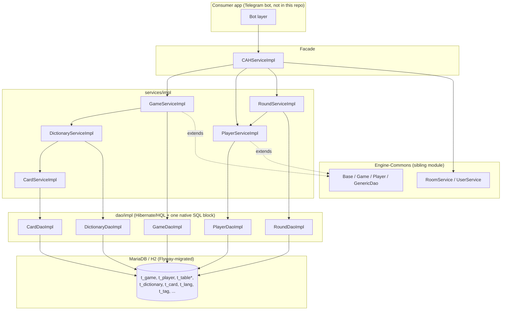
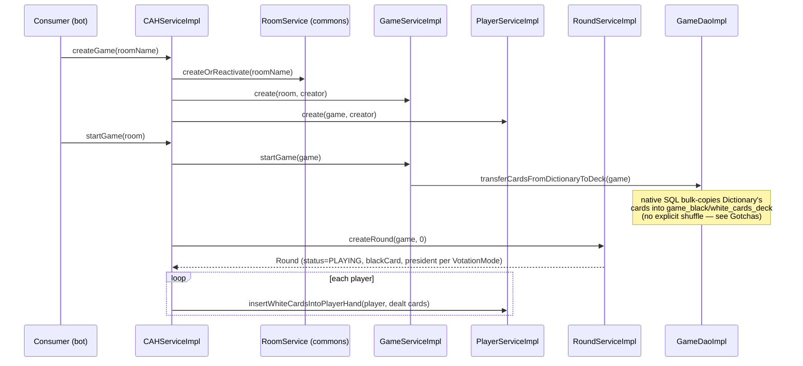

# Codebase Map

> Auto-generated by Cartographer. Last mapped: 2026-08-25T17:30:09Z

## System Overview

CAH-Engine is a Java library (Maven module `org.themarioga:cah-engine`, part of the
`org.themarioga` multi-project family alongside `Engine-Commons`, `SH-Engine`, `Bots`, and
`TelegramBotUtils`) implementing the **domain model, persistence, and business logic for a
multiplayer "Cards Against Humanity" game engine**, driven by (at least) two Telegram bots
(a game bot and a companion dictionary-management bot). It has no controller/web layer of
its own — it's consumed by a separate application module. It depends on the sibling
`engine-commons` library for shared abstractions (`Base`, `Game`, `Player`, generic Hibernate
DAO, `ErrorEnum`/`ApplicationException`, `Room`/`User`/`Lang` entities).



## Directory Structure

```
CAH-Engine/
├── pom.xml                          # single dep: engine-commons; all else inherited from parent POM
├── README.md                        # one-line Spanish description
└── src/
    ├── main/
    │   ├── java/org/themarioga/engine/cah/
    │   │   ├── config/          # DictionariesConfig, GameConfig — @ConfigurationProperties beans
    │   │   ├── constants/       # (none in this module — see TelegramBotUtils sibling for comparison)
    │   │   ├── dao/
    │   │   │   ├── intf/{dictionaries,game}/    # DAO interfaces
    │   │   │   └── impl/{dictionaries,game}/    # Hibernate/HQL DAO implementations
    │   │   ├── enums/           # CAHErrorEnum, CardTypeEnum, PunctuationModeEnum,
    │   │   │                    # RoundStatusEnum, VotationModeEnum
    │   │   ├── exceptions/      # CAHApplicationException + card/dictionary/game/player/round subpackages
    │   │   ├── models/
    │   │   │   ├── dictionaries/    # Card, Dictionary, DictionaryCollaborator
    │   │   │   └── game/            # Game, Player, Round, PlayedCard, VotedCard, PlayerHandCard
    │   │   └── services/
    │   │       ├── intf/{dictionaries,game}/    # service interfaces
    │   │       └── impl/{dictionaries,game}/    # CAHServiceImpl (facade) + per-entity impls
    │   └── resources/
    │       ├── db/migration/{mariadb,h2}/V1/V1.0/{V1.0.0,V1.1.0,V2.0.0}/   # Flyway migrations (mirrored per DB)
    │       ├── default-formatter-config.xml     # inherited code-formatter config
    │       └── supressed-cve-exceptions.xml     # inherited OWASP suppression list
    └── test/
        ├── java/org/themarioga/engine/cah/
        │   ├── BaseTest.java, TestConfiguration.java     # Spring+DBUnit+H2 integration harness
        │   ├── dao/{dictionaries,game}/     # DAO unit tests (pure Mockito, no DB)
        │   └── service/{,dictionaries,game}/    # service unit tests (Mockito) + CAHServiceTest (integration)
        └── resources/dbunit/
            ├── dao/{setup,expected}/        # ⚠ largely unused fixture scaffolding — see Gotchas
            └── service/{setup,expected}/    # setup/ actually used by CAHServiceTest; expected/ unused
```

## Module Guide

### config

**Purpose**: `@ConfigurationProperties`-bound business-rule defaults, injected into services.

| File | Purpose | Tokens |
|------|---------|--------|
| `DictionariesConfig.java` | prefix `cah.dictionaries` — min/max white/black card counts & text lengths, max collaborators, max unfinished dictionaries per user | 633 |
| `GameConfig.java` | prefix `cah.game` — default votation/punctuation mode, points/rounds to win, min/max players, default dictionary id, hand size | 557 |

**Gotcha**: both are `@Validated` but declare **no constraint annotations** (`@NotNull`, `@Min`, …) — missing properties silently bind to `null` instead of failing fast at startup.

### dao (intf + impl)

**Purpose**: Hibernate/HQL persistence layer, one interface+impl pair per aggregate.

| File | Purpose | Tokens |
|------|---------|--------|
| `dao/intf/dictionaries/CardDao.java` / `impl/.../CardDaoImpl.java` | card existence/find/count by dictionary+type | 141 / 360 |
| `dao/intf/dictionaries/DictionaryDao.java` / `impl/.../DictionaryDaoImpl.java` | dictionary lookup, pagination, collaborator/editor checks | 177 / 732 |
| `dao/intf/game/GameDao.java` / `impl/.../GameDaoImpl.java` | extends commons `GameDao<Game>`; adds `transferCardsFromDictionaryToDeck` (native SQL) | 77 / 458 |
| `dao/intf/game/PlayerDao.java` / `impl/.../PlayerDaoImpl.java` | extends commons `PlayerDao<Player>`; adds `findCardByPlayer`/`findVotesByPlayer` | 117 / 371 |
| `dao/intf/game/RoundDao.java` / `impl/.../RoundDaoImpl.java` | `getMostVotedCard`, played/voted card counts | 127 / 371 |

All impls extend `AbstractHibernateDao<T>` (from `engine-commons`), use `getCurrentSession().createQuery(...)` (HQL) and Hibernate 6's `getSingleResultOrNull()`.

**Dependents**: `services/impl/*`.

### enums

| File | Values | Tokens |
|------|--------|--------|
| `CAHErrorEnum.java` | ~24 error codes (30–53) + Spanish descriptions, `getByCode`/`getByDesc` | 658 |
| `CardTypeEnum.java` | `BLACK, WHITE` (ordinal 0/1 — relied on by raw SQL, see Gotchas) | 23 |
| `PunctuationModeEnum.java` | `POINTS, ROUNDS` | 79 |
| `RoundStatusEnum.java` | `PLAYING, VOTING, ENDING` — the round state machine | 31 |
| `VotationModeEnum.java` | `DEMOCRACY, CLASSIC, DICTATORSHIP` | 92 |

**Gotcha**: none of the enum-typed entity columns have an explicit `@Enumerated` — Hibernate 6 defaults to **ordinal** storage, making enum reordering an implicit schema-breaking change (and `GameDaoImpl`'s native SQL hardcodes `type=0`/`type=1`).

### exceptions

**Purpose**: ~30 files, mostly one-line `CAHApplicationException` subclasses pinning a `CAHErrorEnum` constant in a no-arg constructor, organized under `card/`, `dictionary/`, `game/`, `player/`, `round/`.

**Gotcha — mismatched error codes**: several exceptions reuse a `CAHErrorEnum` constant that doesn't match their name/intent: `DictionaryAlreadyPublishedException` and `DictionaryMaxCollaboratorsReached` both reuse `DICTIONARY_ALREADY_FILLED`; `DictionaryNotPublishedException` reuses `DICTIONARY_NOT_FILLED`; `DictionaryCollaboratorCreatorCantBeAltered` reuses `DICTIONARY_COLLAB_NOT_FOUND` instead of the dedicated `DICTIONARY_COLLAB_CREATOR_CANT_BE_ALTERED` (43) code that exists in the enum. `CardNotPlayedException` reuses `CARD_NOT_FOUND`.

**Gotcha — inconsistent base class**: `exceptions/game/*` (`GameAlreadyFilledException`, `GameNotFilledException`) extend commons' `ApplicationException`/`CommonErrorEnum` instead of the local `CAHApplicationException`/`CAHErrorEnum` used everywhere else.

`CAHErrorEnum` also reserves `ROUND_NOT_FOUND`/`ROUND_NOT_STARTED`/`ROUND_NOT_ENDING` (49–51) with no dedicated exception subclass found — presumably thrown ad hoc via `new CAHApplicationException(CAHErrorEnum.X)`.

### models

JPA entities (Jakarta Persistence annotations, Hibernate provider), hand-written getters/setters, no Lombok, no builders.

| File | Purpose | Tokens |
|------|---------|--------|
| `models/dictionaries/Card.java` | a black/white card, belongs to a `Dictionary` | 235 |
| `models/dictionaries/Dictionary.java` | a named card set; owns `collaborators` (cascade ALL, orphanRemoval) | 452 |
| `models/dictionaries/DictionaryCollaborator.java` | composite-PK (`dictionary`+`user`) join entity; `canEdit`/`accepted` flags | 414 |
| `models/game/Game.java` | extends commons `Game`; votation/punctuation config, `players`, `blackCardsDeck`/`whiteCardsDeck` (join tables), `currentRound` (1:1) | 893 |
| `models/game/Player.java` | extends commons `Player`; `points`, `hand`, `playedCard`, `votedCard` | 330 |
| `models/game/Round.java` | `game` (1:1), `roundNumber`, `status`, `roundBlackCard`, `roundPresident` (nullable), `playedCards`/`votedCards` | 587 |
| `models/game/PlayedCard.java` | composite-PK (`round`+`player`+`card`) — a submitted white card | 332 |
| `models/game/VotedCard.java` | composite-PK (`round`+`player`+`card`) — a cast vote | 339 |
| `models/game/PlayerHandCard.java` | composite-PK (`player`+`card`) — a card in a player's hand | 263 |

All extend `Base` (`engine-commons`: `@MappedSuperclass`, `UUID id`, `Date creationDate`) except the composite-key join entities.

**Entity relationships**:
```
User ──creator──> Dictionary ──1:N──> DictionaryCollaborator <──N:1── User
Lang <──N:1── Dictionary ──1:N──> Card (type: BLACK/WHITE)

Room <──1:1──> Game ──N:1──> Dictionary
User <──1:1(creator)── Game ──1:N──> Player ──N:1(unique)──> User
Game ──1:1──> Round (currentRound)         Game ──N:M(join tables)──> Card (decks)

Round ──N:1──> Card (roundBlackCard)   Round ──N:1──> Player (roundPresident, nullable)
Round ──1:N──> PlayedCard              Round ──1:N──> VotedCard
Player ──1:N──> PlayerHandCard         Player ──1:1──> PlayedCard    Player ──1:1──> VotedCard
```

### services (intf + impl)

**Purpose**: The business-logic/game-rules layer. `CAHServiceImpl` is a pure orchestration facade (session-user resolution + authorization + cross-service workflows) sitting on top of `GameService`, `PlayerService`, `RoundService`, `DictionaryService`/`CardService`, and commons' `RoomService`.

| File | Purpose | Tokens |
|------|---------|--------|
| `services/intf/CAHService.java` / `impl/CAHServiceImpl.java` | top-level facade: create/configure/join/start/play/vote/next-round/winner | 273 / 3771 |
| `services/intf/game/GameService.java` / `impl/game/GameServiceImpl.java` | `Game` aggregate: lobby config, status transitions, membership, deletion voting | 184 / 2907 |
| `services/intf/game/RoundService.java` / `impl/game/RoundServiceImpl.java` | `Round`: president assignment, played/voted cards, black-card draw | 190 / 2036 |
| `services/intf/game/PlayerService.java` / `impl/game/PlayerServiceImpl.java` | `Player`: hand, points, join order | 119 / 1094 |
| `services/intf/dictionaries/DictionaryService.java` / `impl/.../DictionaryServiceImpl.java` | `Dictionary`: create/publish/share, collaborators | 285 / 2355 |
| `services/intf/dictionaries/CardService.java` / `impl/.../CardServiceImpl.java` | `Card`: create/edit validation, publish-eligibility check | 152 / 1142 |

**Dependency graph** (star centered on `CAHServiceImpl`, no cycles):
`CAHServiceImpl` → `GameService`, `PlayerService`, `RoundService`, `RoomService`(commons) · `GameServiceImpl` → `DictionaryService` (default dictionary only) · `RoundServiceImpl` → `PlayerService` (dictatorship president only) · `DictionaryServiceImpl` → `CardService` (publish-eligibility only).

All mutating methods are `@Transactional(propagation = REQUIRED, rollbackFor = ApplicationException.class)`; reads use `SUPPORTS`.

## Data Flow

### Game creation → start → round 0



### Play / vote / round-end cycle

```mermaid
sequenceDiagram
    participant Bot as Consumer (bot)
    participant CAH as CAHServiceImpl
    participant Round as RoundServiceImpl

    Bot->>CAH: playCard(room, card)
    CAH->>Round: addCardToPlayedCards(round, player, card)
    alt everyone has played
        CAH->>Round: setStatus(round, VOTING)
    end
    Bot->>CAH: voteCard(room, card)
    CAH->>Round: voteCard(round, player, card)
    alt vote quorum reached
        CAH->>Round: getMostVotedCard(round)
        Note over CAH: winner's player.points += 1
        CAH->>Round: setStatus(round, ENDING)
        Note over CAH: checkIfGameEnded → maybe game.status = ENDING
    end
    Bot->>CAH: nextRound(game)
    Note over CAH: requires round.status == ENDING;<br/>deletes old round, createRound(roundNumber+1)
```

**Votation-mode differences** (enforced across `CAHServiceImpl`/`RoundServiceImpl`, inline `if`-branches, no strategy pattern):
- **CLASSIC / DICTATORSHIP**: round president doesn't play; only the president votes; that single vote is decisive.
- **DEMOCRACY**: no president; everyone (except the card's own player) votes; quorum = all players.
- President assignment: DICTATORSHIP → always the game creator; CLASSIC → round-robin by `joinOrder`, `players.get(roundNumber % players.size())`; DEMOCRACY → none.

## Conventions

- **Interface + impl split**, mirrored under `intf`/`impl` for both `dao` and `services`.
- Entities extend `engine-commons`' `Base`/`Game`/`Player` for shared id/creation-date/status/room/creator/membership plumbing; CAH only adds game-specific fields.
- Composite-primary-key join entities (`PlayedCard`, `VotedCard`, `PlayerHandCard`, `DictionaryCollaborator`) use multiple `@Id @ManyToOne` fields (Hibernate convenience, not strict JPA `@IdClass`/`@EmbeddedId`).
- Exceptions: one thin subclass per business rule, each pinning a `CAHErrorEnum`/`CommonErrorEnum` constant via a no-arg constructor.
- `t_`-prefixed snake_case DB tables (Flyway, dual-migrated under `mariadb/` and `h2/` trees with identical filenames/content).
- Config: `@ConfigurationProperties` POJOs (`cah.dictionaries.*`, `cah.game.*`) rather than hardcoded constants.
- Tests: JUnit 5 + Mockito unit tests are the default; exactly one class (`CAHServiceTest`) is a full Spring+DBUnit+H2 integration test.

## Gotchas

**Cross-cutting / architectural**
- **No shuffle**: card dealing has no explicit randomization anywhere — `transferCardsFromDictionaryToDeck` is a native SQL `INSERT ... SELECT` with no `ORDER BY RANDOM()`, and dealing/drawing always takes from the front of the resulting list (`subList(0, n)`, `deck.get(0)`). Any apparent randomness is an accidental byproduct of unspecified SQL row order.
- **No tie-breaking on votes**: `RoundDao.getMostVotedCard` (`GROUP BY card ORDER BY COUNT(v) DESC LIMIT 1`) has no deterministic tie-break; `CAHServiceImpl.getWinner` likewise just sorts players by points descending and returns index 0 — ties resolved arbitrarily.
- **`endGame` deletes the game row** entirely (no archival) — confirmed independently by both source and `GameServiceTest`.
- **One game per user, globally**: `PlayerServiceImpl.create` rejects if the user is already a player in *any* game system-wide, not just the target room.
- **Enum ordinal storage**: no `@Enumerated` anywhere; reordering `CardTypeEnum`/`RoundStatusEnum`/`VotationModeEnum`/`PunctuationModeEnum` is an implicit breaking schema change, and `GameDaoImpl`'s native SQL hardcodes `type=0`(BLACK)/`type=1`(WHITE).
- **`PlayerDao.findCardByPlayer`/`findVotesByPlayer` look broken**: their HQL filters `pc.id = :player_id` against `PlayedCard`/`VotedCard`, but those entities have a composite key, not a simple `id` — likely dead/unfinished code.
- **`LIKE` used for exact-match checks**: `CardDaoImpl.checkCardExistsByDictionaryTypeAndText` and `DictionaryDaoImpl.countDictionariesByName` use HQL `LIKE :text` where exact equality is intended — unescaped `%`/`_` in user input would behave as wildcards.
- **`nextRound(Game)`** takes a `Game`, unlike every other `CAHService` method which takes a `Room` — API inconsistency.
- **Mismatched exception→error-code mappings** and **inconsistent exception base class** — see the `exceptions` module entry above.
- **Toggle-based publish/share/collaborator methods** (`togglePublished`, `toggleShared`, `toggleAcceptedCollaborator`, `toggleCanEditCollaborator`) are literal boolean flips with no dedicated "publish"/"unpublish" methods — `togglePublished` re-runs the full publish-eligibility check even when un-publishing.
- **Dictionary creator is a protected collaborator** — cannot be altered/removed via collaborator-management methods; an unaccepted (pending) collaborator is treated identically to a non-existent one by `toggleCanEditCollaborator`.
- **`@Validated` configs have no constraints** — `DictionariesConfig`/`GameConfig` silently bind missing properties to `null` rather than failing fast.

**Test suite**
- **Most of `src/test/resources/dbunit/` is unused scaffolding.** Only `dbunit/service/setup/*.xml` is actually wired up (via `@DatabaseSetup` in `CAHServiceTest`). All of `dbunit/dao/*` and all `dbunit/service/expected/*` "expected" fixtures exist on disk but are referenced by **no** test class — no `@ExpectedDatabase` annotation exists anywhere in the suite. Treat that fixture tree as stale/aspirational, not as documentation of current behavior.
- DAO tests (`CardDaoTest`, `DictionaryDaoTest`, `GameDaoTest`, `PlayerDaoTest`) are pure Mockito unit tests despite matching DBUnit fixtures existing — a naming trap for anyone assuming fixture-driven DB tests exist.
- `CAHServiceTest` is the **only** integration test (`extends BaseTest`, real H2 + DBUnit + full Spring context, `@DirtiesContext` per method) and is the only place multi-round, multi-votation-mode game simulations are verified end-to-end.
- Business rules only visible via tests (not obvious from source alone): deletion-vote threshold is majority `(players/2)+1`; `setNumberOfPointsToWin`/`setNumberOfRoundsToEnd` each implicitly flip `punctuationMode`; DEMOCRACY changes both play/vote quorum *and* which win-condition field governs game end vs CLASSIC/DICTATORSHIP.

## Navigation Guide

**To add or change a game rule** (win condition, hand size, player bounds): `config/GameConfig.java` (default) + `services/impl/game/GameServiceImpl.java` / `services/impl/CAHServiceImpl.java` (enforcement).

**To change round/voting mechanics** (president assignment, play/vote quorum, tie-breaking): `services/impl/game/RoundServiceImpl.java` and `dao/impl/game/RoundDaoImpl.java` (`getMostVotedCard`).

**To add a new votation or punctuation mode**: `enums/VotationModeEnum.java` / `PunctuationModeEnum.java`, then update every inline `if`-branch in `CAHServiceImpl` and `RoundServiceImpl` that checks these modes (no strategy-pattern abstraction exists yet).

**To change dictionary/card validation rules**: `config/DictionariesConfig.java` (limits) + `services/impl/dictionaries/CardServiceImpl.java` / `DictionaryServiceImpl.java` (enforcement).

**To add a new persisted field**: add to the JPA entity in `models/`, add a Flyway migration under **both** `src/main/resources/db/migration/mariadb/...` and the mirrored `h2/...` path, bump the version folder appropriately.

**To add a new error condition**: add a constant to `enums/CAHErrorEnum.java`, then add a matching `CAHApplicationException` subclass under the relevant `exceptions/<area>/` package — double-check you're not accidentally reusing an existing unrelated error code (see Gotchas).

**To understand actual game-flow business rules** (beyond what source alone shows): read `src/test/java/org/themarioga/engine/cah/service/CAHServiceTest.java` — it's the only end-to-end test and documents deletion-vote thresholds, per-votation-mode scoring/quorum differences, and win determination via three full game-simulation tests.

**To fix the dead/broken `PlayerDao.findCardByPlayer`/`findVotesByPlayer` queries**: `dao/intf/game/PlayerDao.java` + `dao/impl/game/PlayerDaoImpl.java` — the composite-key mismatch needs resolving before these are safe to call.
